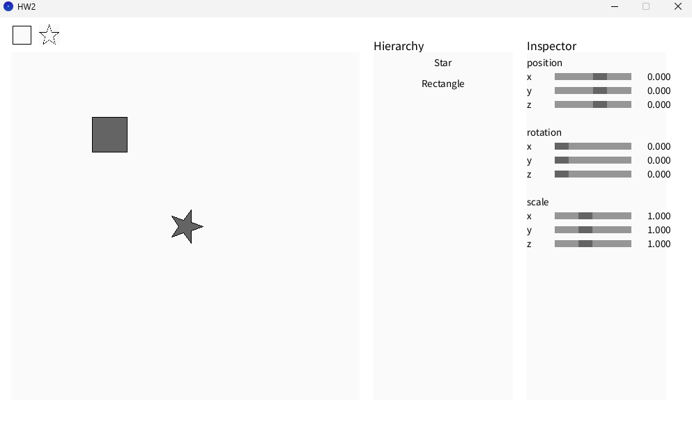
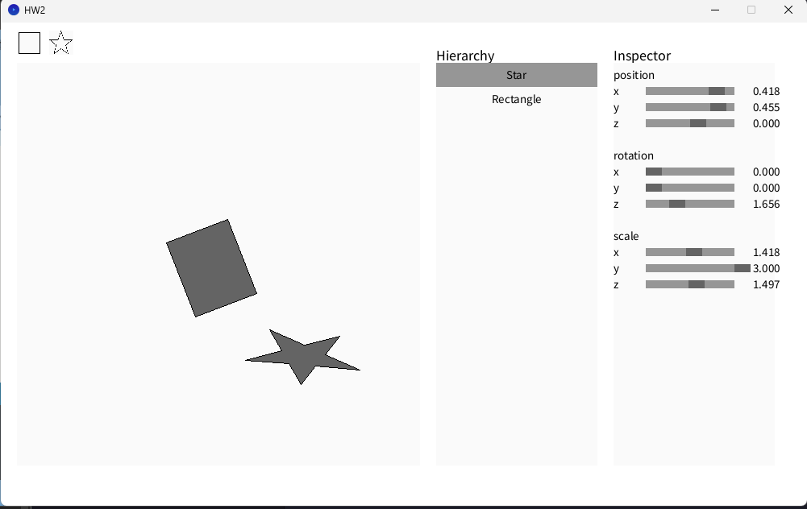
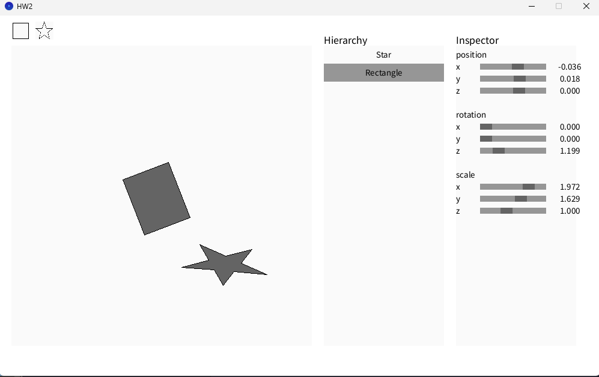

# 計算機圖學實驗2

## 1. Translation Matrix

**核心算法：** 利用齊次座標系統，在 4x4 矩陣中加入平移向量。

```java
void makeTrans(Vector3 t) {
    makeIdentity();
    m[3] = t.x;   // X方向平移
    m[7] = t.y;   // Y方向平移
    m[11] = t.z;  // Z方向平移
}
```

**重點：**

- 平移分量必須放在矩陣最後一列的位置
- 其他元素保持單位矩陣，這樣就不會影響旋轉或縮放。

## 2. Rotation Matrix (Z-axis)

**核心算法：** 用三角函數實現繞 Z 軸的旋轉，也就是把 2D 旋轉延伸到 3D 空間。

```java
void makeRotZ(float a) {
    makeIdentity();
    float cosA = cos(a);
    float sinA = sin(a);
    m[0] = cosA;   m[1] = -sinA;  // 第一行
    m[4] = sinA;   m[5] = cosA;   // 第二行
}
```

**重點：**

- 採用標準旋轉矩陣公式 `cos(a), -sin(a); sin(a), cos(a)`
- Z軸分量保持不變，實現純2D旋轉在3D空間中的效果
- 角度使用弧度制

## 3. Scaling Matrix

**核心算法：** 直接透過對角線元素來控制各軸的縮放比例。

```java
void makeScale(Vector3 s) {
    makeIdentity();
    m[0] = s.x;   // X方向縮放
    m[5] = s.y;   // Y方向縮放
    m[10] = s.z;  // Z方向縮放
}
```

**關鍵發現：**

- 對角線的值決定了各軸的縮放倍數。
- 可以做「非均勻縮放」，讓 X、Y、Z 軸各自不同。
- 預設是以「原點」為縮放中心。

## 4. Is the point inside a shape?

**核心算法：** 用射線投射法來判斷點是否在多邊形內。

```java
boolean pnpoly(float x, float y, Vector3[] vertexes) {
    boolean inside = false;
    int n = vertexes.length;

    for (int i = 0, j = n - 1; i < n; j = i++) {
        float xi = vertexes[i].x, yi = vertexes[i].y;
        float xj = vertexes[j].x, yj = vertexes[j].y;

        if (((yi > y) != (yj > y)) && (x < (xj - xi) * (y - yi) / (yj - yi) + xi)) {
            inside = !inside;
        }
    }

    return inside;
}
```

**重點心得：**

- 利用射線投射法，從點發出一條水平射線，統計跟邊界的交點數。
- 交點數是奇數 → 點在多邊形內；偶數 → 點在外面。
- 可以處理凹多邊形，不只限於凸的形狀。

## 5. Find the boundary of a polygon

**核心算法：** 掃描所有頂點，找出 X、Y、Z 的最小值與最大值，建立軸對齊邊界框 (AABB)。

```java
public Vector3[] findBoundBox(Vector3[] v) {
    if (v.length == 0) return new Vector3[]{new Vector3(0), new Vector3(0)};

    float minX = v[0].x, minY = v[0].y, minZ = v[0].z;
    float maxX = v[0].x, maxY = v[0].y, maxZ = v[0].z;

    for (int i = 1; i < v.length; i++) {
        minX = min(minX, v[i].x);
        minY = min(minY, v[i].y);
        minZ = min(minZ, v[i].z);
        maxX = max(maxX, v[i].x);
        maxY = max(maxY, v[i].y);
        maxZ = max(maxZ, v[i].z);
    }

    return new Vector3[]{new Vector3(minX, minY, minZ), new Vector3(maxX, maxY, maxZ)};
}
```

**關鍵發現：**

- 一次遍歷就能找出所有軸的極值。
- 得到的結果是最小包圍盒 (AABB)，方便做空間判斷。
- 大幅減少不必要的渲染計算，提升整體效能。

## 6. Keep the polygon inside the canvas

**核心算法：** 使用 Sutherland–Hodgman 多邊形剪裁演算法，讓多邊形保持在畫布範圍內。

```java
public Vector3[] Sutherland_Hodgman_algorithm(Vector3[] points, Vector3[] boundary) {
    ArrayList<Vector3> input = new ArrayList<Vector3>();
    ArrayList<Vector3> output = new Vector3[points.length];
    for (int i = 0; i < points.length; i += 1) {
        input.add(points[i]);
    }

    // 對每個剪輯邊進行處理
    for (int i = 0; i < boundary.length; i++) {
        output.clear();

        Vector3 clipStart = boundary[i];
        Vector3 clipEnd = boundary[(i + 1) % boundary.length];

        // 處理多邊形的每一條邊
        for (int j = 0; j < input.size(); j++) {
            Vector3 current = input.get(j);
            Vector3 previous = input.get((j + input.size() - 1) % input.size());

            boolean currentInside = isInside(current, clipStart, clipEnd);
            boolean previousInside = isInside(previous, clipStart, clipEnd);

            if (currentInside) {
                if (!previousInside) {
                    Vector3 intersection = computeIntersection(previous, current, clipStart, clipEnd);
                    if (intersection != null) {
                        output.add(intersection);
                    }
                }
                output.add(current);
            } else if (previousInside) {
                Vector3 intersection = computeIntersection(previous, current, clipStart, clipEnd);
                if (intersection != null) {
                    output.add(intersection);
                }
            }
        }

        input.clear();
        input.addAll(output);
    }

    Vector3[] result = new Vector3[output.size()];
    for (int i = 0; i < result.length; i++) {
        result[i] = output.get(i);
    }
    return result;
}
```

**輔助函數：**

```java
private boolean isInside(Vector3 point, Vector3 clipStart, Vector3 clipEnd) {
    float cross = (clipEnd.x - clipStart.x) * (point.y - clipStart.y) -
                  (clipEnd.y - clipStart.y) * (point.x - clipStart.x);
    return cross <= 0;
}

private Vector3 computeIntersection(Vector3 p1, Vector3 p2, Vector3 q1, Vector3 q2) {
    float dx1 = p2.x - p1.x;
    float dy1 = p2.y - p1.y;
    float dx2 = q2.x - q1.x;
    float dy2 = q2.y - q1.y;

    float denominator = dx1 * dy2 - dy1 * dx2;

    if (Math.abs(denominator) < 1e-10) {
        return null;
    }

    float t = ((q1.x - p1.x) * dy2 - (q1.y - p1.y) * dx2) / denominator;

    if (t >= 0 && t <= 1) {
        float x = p1.x + t * dx1;
        float y = p1.y + t * dy1;
        return new Vector3(x, y, 0);
    }

    return null;
}
```

**關鍵發現：**

- 用叉積判斷點在邊界內外，方向要保持一致（順時針或逆時針）。

# Some Screenshots



